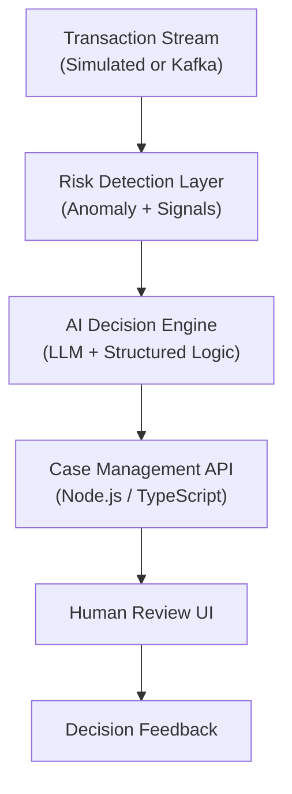

# 🧠 System: Sentinel — AI-Native Compliance Decision Engine

## 1️⃣ High-Level Architecture



---

## 2️⃣ Core Stack

### Backend

-   **Node.js + TypeScript**
-   **Express**
-   **Prisma ORM**
-   **PostgreSQL**
-   **Redis** (caching, rate limiting, idempotency keys)

### AI Layer

-   **OpenAI / Claude / Local LLM** (abstracted behind adapter)
-   **Embeddings model** for:
    -   Behavioral similarity
    -   Historical case retrieval
-   **JSON-structured outputs** (strict schema validation via Zod)

### Data Layer

-   **PostgreSQL Tables:**
    -   `users`
    -   `transactions`
    -   `risk_profiles`
    -   `cases`
    -   `ai_decision_drafts`
    -   `human_reviews`
    -   `audit_logs`

### Frontend

-   Angular 17+ standalone components
-   Angular Signals
-   HttpClient
-   Tailwind

---

## 3️⃣ AI-Native Design (**Important**)

> This is not “LLM as helper.”
> **AI owns first-draft decision. Architect around that.**

---

## 4️⃣ Risk Detection Layer

**Hybrid Approach**

### A) Deterministic Signals

-   Large transaction spike
-   Geo-velocity anomaly
-   Rapid withdrawal after deposit
-   Structuring patterns

### B) Statistical Baseline

_For demo:_

-   Z-score deviation from historical mean
-   Time-of-day anomaly
-   Merchant frequency anomaly

Store baseline in:

```typescript
risk_profiles {
  user_id
  avg_tx_amount
  std_dev
  common_merchants[]
  typical_geo_locations[]
}
```

---

## 5️⃣ AI Decision Engine

**This is the heart of the system.**

### Input to AI

Structured JSON:

```json
{
  "user_profile": {...},
  "recent_transactions": [...],
  "detected_signals": [...],
  "risk_score": 0.82,
  "regulatory_policy_context": {...}
}
```

### LLM Prompt Responsibilities

The AI must:

-   Write structured risk narrative
-   Classify risk level (**Low / Medium / High**)
-   Recommend action:
    -   No action
    -   Monitor
    -   Temporary hold
    -   Escalate to human
-   Provide justification
-   Provide confidence level
-   Identify fairness concerns

### Enforce Structured Output

Use Zod schema:

```typescript
const DecisionSchema = z.object({
	risk_level: z.enum(["LOW", "MEDIUM", "HIGH"]),
	recommended_action: z.enum(["NO_ACTION", "MONITOR", "TEMP_HOLD", "ESCALATE"]),
	justification: z.string(),
	confidence: z.number().min(0).max(1),
	fairness_flags: z.array(z.string()),
});
```

Reject non-conforming output.

---

## 6️⃣ Human Review Boundary

**UI shows:**

-   Risk narrative
-   Supporting signals
-   Confidence
-   Similar historical cases (via embeddings)
-   Approve / Override
-   Reason for override

**Human must approve:**

-   Permanent closure
-   Law enforcement report

**System-level guardrail:**

```typescript
if (recommended_action === "PERMANENT_CLOSE") {
	throw new Error("AI cannot perform irreversible action");
}
```

---

## 7️⃣ Retrieval-Augmented Compliance

**Add a mini RAG (Retrieval-Augmented Generation) layer.**

### Index:

-   Regulatory policy docs
-   Internal compliance playbooks
-   Past human-reviewed cases

### Flow:

-   Embed current case
-   Retrieve similar historical decisions
-   Provide to LLM for better consistency

_This enables real-world thinking._

---

## 8️⃣ Auditability (**Critical for Fintech**)

Every step logged:

```typescript
audit_logs {
  actor_type: "AI" | "HUMAN"
  action
  timestamp
  input_hash
  output_hash
}
```

Hash inputs/outputs for tamper detection.
